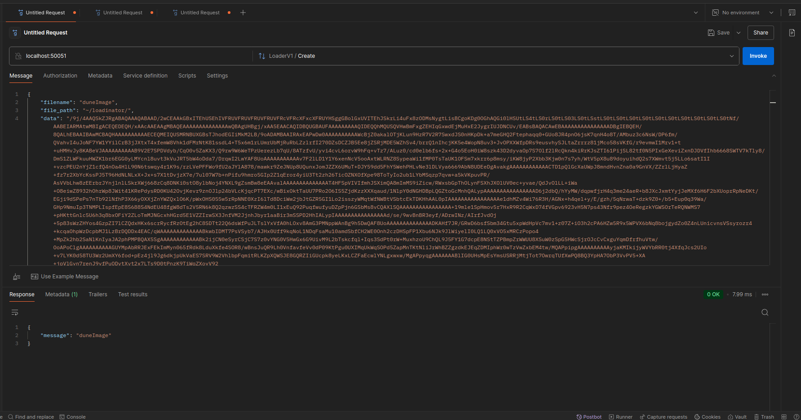
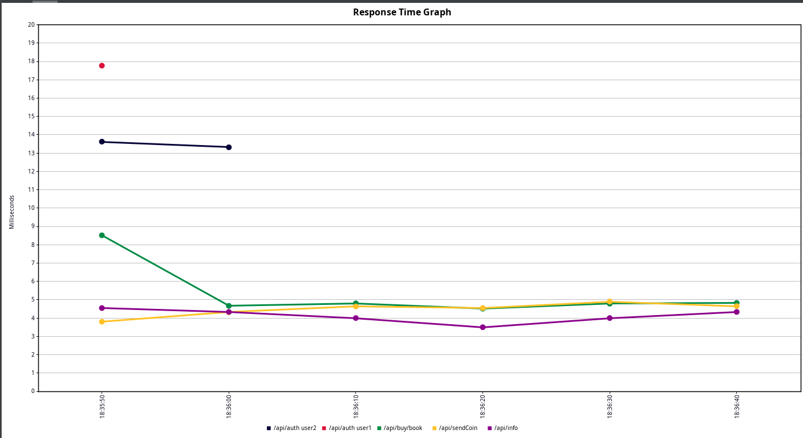
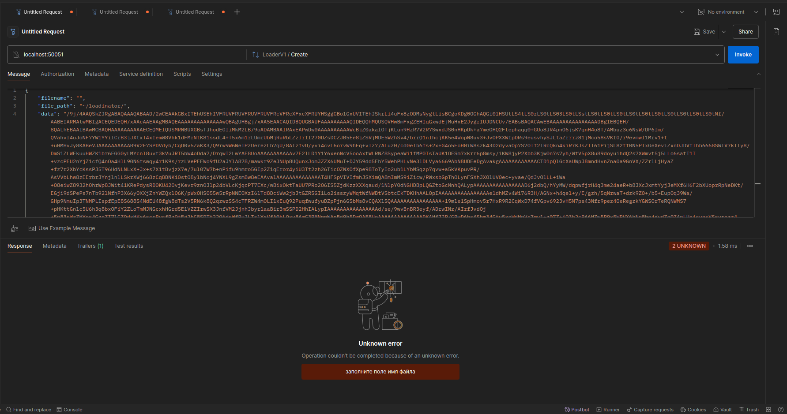
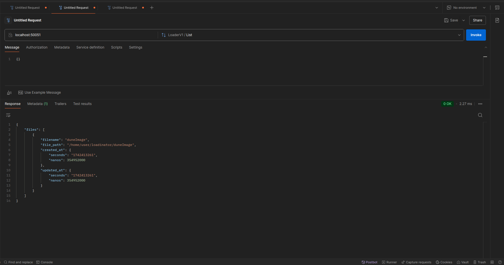
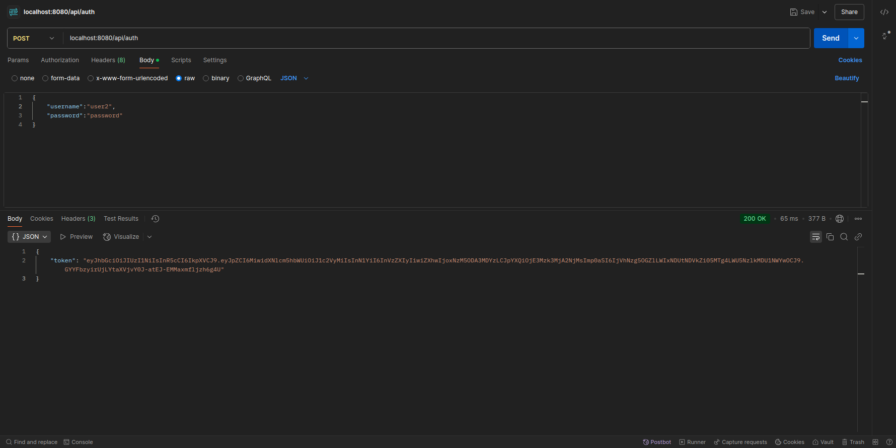

# 🚀 Запуск проекта

### 🚧 Ход решения
 - Возможно, сервис выглядит переусложнённым, т.к. ТЗ относительно простое, вполне можно было ограничиться 2-3 пакетами. 
   Однако, решил сделать всё, как полагается.  
   В итоге получили масштабируемый gRPC сервис загрузчика.   
   В пакете service добавлены комментарии с логикой работы.
   Все метаданные файла, хранятся в БД. Сам файл сохраняется по заданному пользователем пути на локальной машине.  

### 1. Клонировать репозиторий
```bash   
git clone https://github.com/MaksimovDenis/loadinator2000.git
```
### 2. Перейти в директорию проекта (если Вы не в ней).  
```bash  
cd loadinator2000 
```  
### 3. Локальная установка зависимостей и поднятие БД на порту 5432:  
```bash      
make all
```  
### 4. После поднятия базы, запустите сервис в новом терминале (чтобы файлы можно было сохранять по любому пути на локальной машине):  
```bash      
go run .
```  
### 5. Остановка  
```bash      
make down
```
### 6. Запуск линтера (из дериктории проекта)
```bash
golangci-lint run -c .golangci.yml
```

# 🛠Реализация  
- Подход с чистой архитектурой (сервис разбит на DLA, BLL и API слои).  
- Язык программирование: Golang 1.22.12  
- Для реализации grpc сервер 
- База данных: PostgreSQL:latest
- В качестве билдера sql применялся squirrel 
- Логер zerolog   
- Линитер golangci-lint:  

# ✅ Условия  
1. Принимать бинарные файлы (изображения) от клиента и сохранять их на жесткий диск. ✅     
2. Иметь возможность просмотра списка всех загруженных файлов в формате: Имя файла | Дата создания | Дата обновления✅   
3. Отдавать файлы клиенту.✅      
4. Ограничивать количество одновременных подключений с клиента:    
    - на загрузку/скачивание файлов - 10 конкурентных запросов;✅   
    - на просмотр списка файлов - 100 конкурентных запросов. ✅      

# 🧑‍💻Примеры запросов 
 - gRPC Эндпоинт (Создать): **/Create**
     
     
    
 - gRPC Эндпоинт (Cписок файлов): **/List**  
    
 - gRPC Эндпоинт (Получение файла): **/Get**  
    
