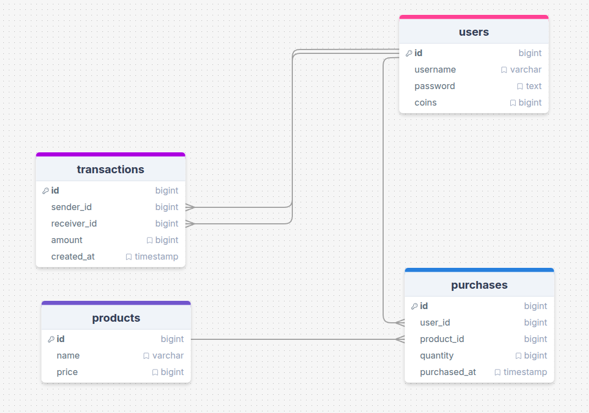
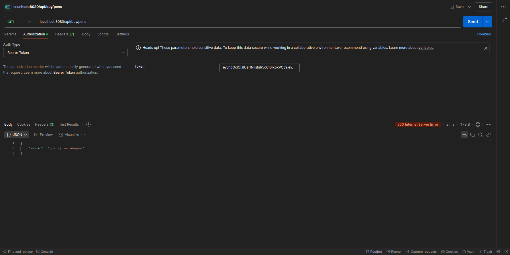
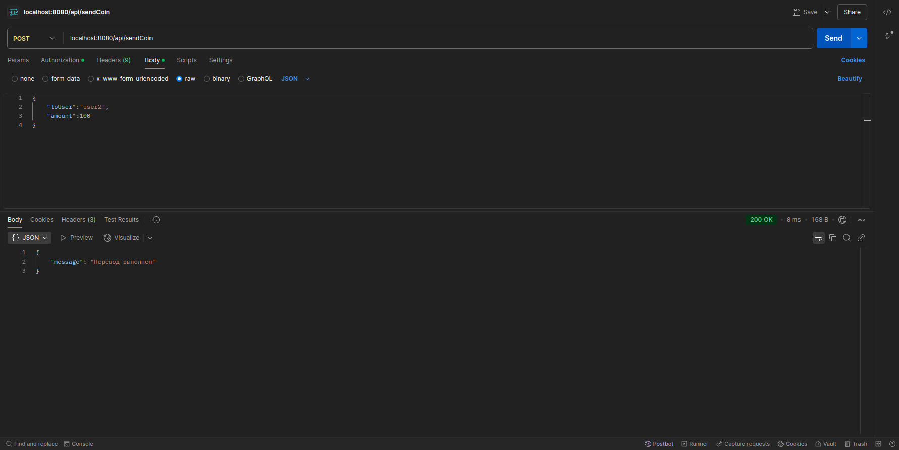
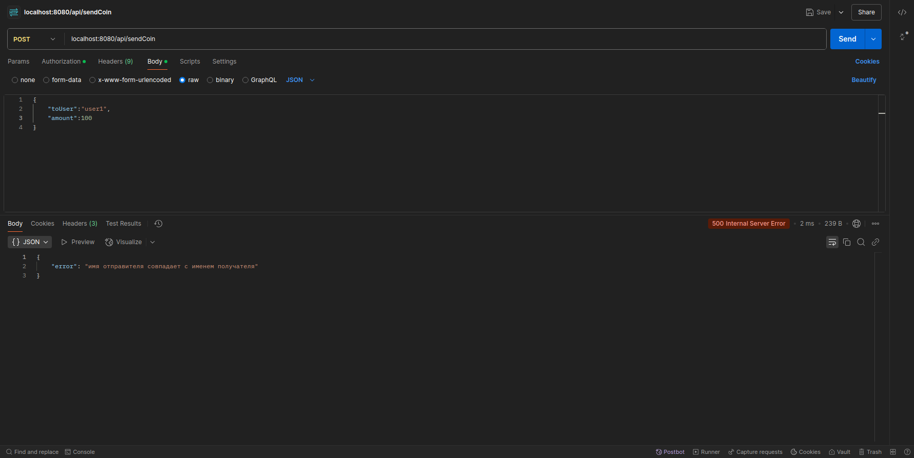
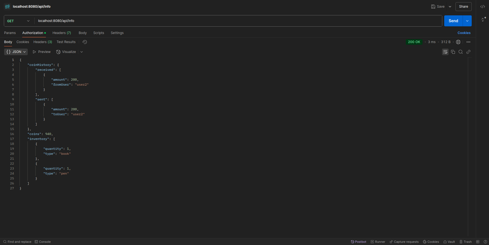
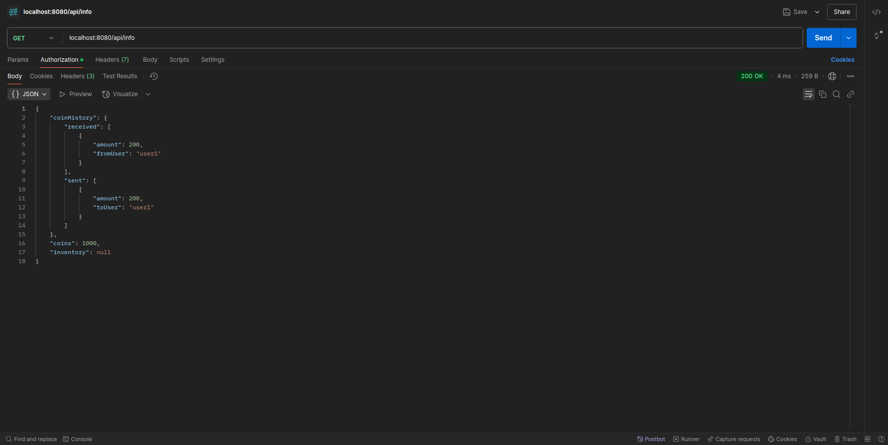
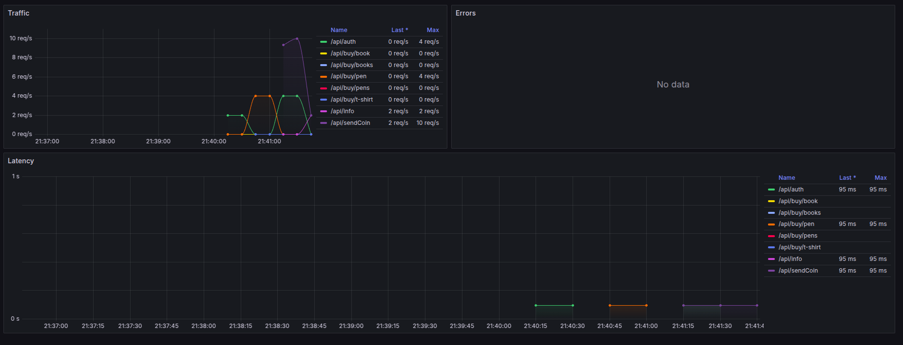

# 🚀 Запуск проекта

### 1. Клонировать репозиторий
```bash   
git clone https://github.com/MaksimovDenis/Avito_merch_shop.git
```
### 2. Перейти в директорию проекта (если Вы не в ней).  
```bash  
cd Avito_merch_shop  
```  
### 3. Из дериктории проекта выполнить команды, сервис будет доступен по порту 8080:  
```bash      
docker compose up --build 
```  
### 4. Остановка  
```bash      
docker compose down
```
### 5. Запуск линтера (из дериктории проекта)
```bash
golangci-lint run -c .golangci.yml
```
P.S. Миграции таблиц накатываются автоматически.  

# 🛠Реализация  
- Подход с чистой архитектурой (сервис разбит на DLA, BLL и API слои).  
- Язык программирование: Golang 1.22.12  
- Для реализации http сервера использовалась библиотека gin  
- Кодогенерация oapi-codegen  
- База данных: PostgreSQL:latest
- В качестве билдера sql применялся squirrel 
- Схема БД:  
   
- Логер zerolog   
- Линитер golangci-lint:  

```bash  
run:
  timeout: 5m

linters-settings:
  revive:
    rules:
      - name: empty-lines
  varnamelen:
    check-receiver: true
    check-return: true
    check-type-param: true
    ignore-type-assert-ok: true
    ignore-map-index-ok: true
    ignore-chan-recv-ok: true
    ignore-names:
      - err
      - ok
      - tx
      - id
      - tc # testCase for tests
      - tt # testCase for tests
      - pg
      - f # func(f)
    ignore-decls:
      - t testing.T
      - T any
      - e error
      - w http.ResponseWriter
      - r *http.Request
      - wg *sync.WaitGroup
      - wg sync.WaitGroup
      - T comparable
      - w io.Writer

linters:
  enable:
    - revive
    - bodyclose
    - gocritic
    - lll
    - wsl
    - gofmt
    - unparam # disabled in CI
    - varnamelen # disabled in CI  
```    
# ✅ Условия  
1. Использовался приложенный к ТЗ API, без изменений: https://github.com/MaksimovDenis/Avito_merch_shop/blob/main/pkg/protocol/oapi/schema.yml ✅    
2. Пользовательский токен доступа к API выдается после авторизации/регистрации пользователя. При первой авторизации пользователь создаватёся автоматически.✅   
3. Бизнес сценарии покрыты интеграционными (service) и юнит тестами.✅     
4. Сотрудников может быть до 100к, RPS — 1k, SLI времени ответа — 50 мс, SLI успешности ответа — 99.99% ✅  

# 🔧Дополнительные задания
1. Линтер .golangci.yaml приложен в корень проекта.✅
2. Реализованы интеграционные тесты для всех сценариев.✅
3. Проведено нагрузочное тестирование с помощью APache JMeter 5.6.3 (RPS 1k, тест план приложен в корень проекта)✅
 - Результаты нагрузочного тестирования (в среднем ответ не превышает 10ms): 
     
   

# 🚧 Ход решения
 - Как таковых проблем не возникло, в бизнес слое описаны комментарии с логикой работы.    

# 🧑‍💻Некоторые примеры запросов 
 - Эндпоинт (Регистрация пользователя №1 и №2): **POST /api/auth**  
     
     
 - Эндпоинт (Покупка товара: book): **GET /api/buy/book**  
    
 - Эндпоинт (Покупка товара: pen): **GET /api/buy/pen**  
    
 - Эндпоинт (Покупка несуществующего товара: pens): **GET /api/buy/pens**  
    
 - Эндпоинт (Перевод средств пользователю user2): **POST /api/sendCoin**  
    
 - Эндпоинт (Перевод средств превышеющих баланс пользователя): **POST /api/sendCoin**  
    
 - Эндпоинт (Перевод средств самому себе): **POST /api/sendCoin**  
    
 - Эндпоинт (Информация о балансе и истории транзакции пользователя user1): **GET /api/info**  
    
 - Эндпоинт (Информация о балансе и истории транзакции пользователя user2): **GET /api/info**  
    

# 🚧 Что следует улучшить  
- Стоит улучшить систему валидации полей, основные сценарии учтены, но не все.  
- Необходимо улучшить систему обработки всех возможных ошибок.  
- Дополнить код большим количеством тестов.  
- Дополнить сервис системой кеширования, например, через Redis, по патерну Singleton.
- Хорошо будет добавить полноценную систему авторизации и аутентификации с refresh и access токенами.  

# Из дополнительного (для себя)     
- Дополнил сервис основными http метриками. По ендпоинту **GET /metrics**    
- Сбор осуществляется при помощи prometheus.   
- Локально подключил grafana, но в сборку докера добавлять не стал, чтобы не утяжелять запуск.   
     